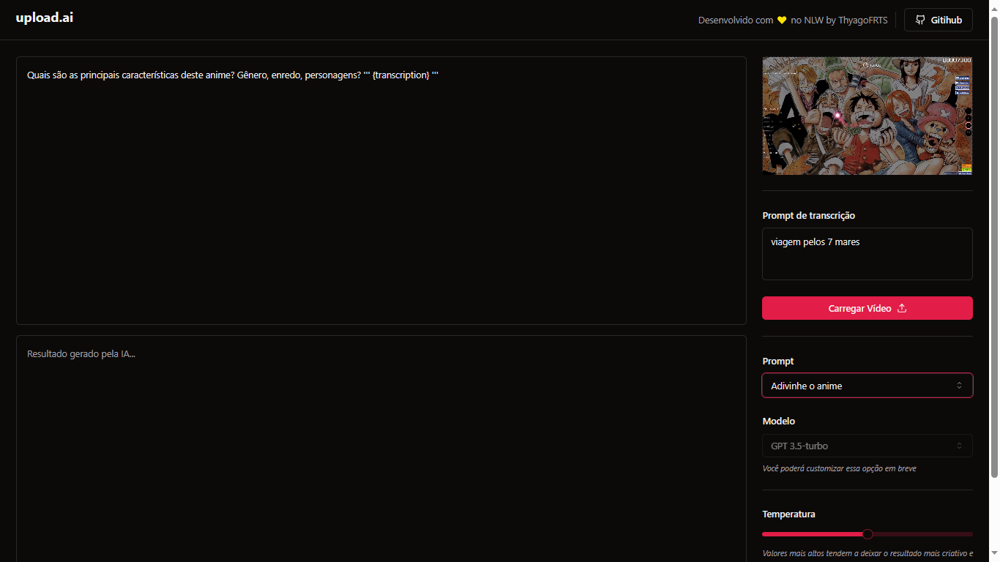

# UPLOAD-AI

  

This is an application created in "Next Level Week" event

The application use OpenAI models to apply previous prompts over video transcriptions

<h2>Funcionalitties</h2>
<ul>
  <li>Load video</li>
  <li>Convert mp4 to mp3</li>
  <li>Audio transcription</li>
  <li>Apply prompts from GPT3</li>
  <li>Video Management</li>
</ul>
<h2>Technologies</h2>
<ul>
  <li>React + Typescript</li>
  <li>Prisma ORM</li>
  <li>FFMPEG</li>
  <li>OpenAI APIs</li>
  <li>Tailwind</li>
  <li>SQLite</li>
</ul>
<h2>How to use</h2>
<ul>
  <li>See readme in api and web folders to install the frontend and api</li>
  <li>Run api server and react server</li>
  <li>Use app in localhost:3333</li>
</ul>
